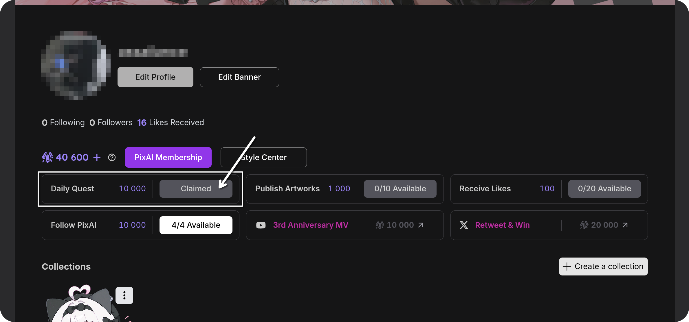

Script for **automatic** receipt of **daily rewards** on <a href="https://pixai.art">PixAI</a>.

## 🚀 Quick Start

Clone the repository, set up environment variables and run using docker:

```bash
# Clone repository
git clone https://github.com/assailance/pixai-daily-rewards
cd pixai-daily-rewards

# Configure environment variables:
# 1) set USE_DOCKER_SELENIUM=True and SELENIUM_REMOTE_URL=http://selenium:4444/wd/hub
# 2) set up other variables (see "⚙️ Environment variables")
mv .env.template .env

# Run Docker Compose (this will pull required images,
# run the script, and remove the containers after completion)
docker compose up --abort-on-container-exit && docker compose down
```

## 🛠️ Running without docker

1. Download **chrome** (binary) and **chromedriver** of the required version
2. Install **dependencies**:

```bash
# Using pip
python3 -m venv venv
source venv/bin/activate
pip install -r requirements.txt

# Or using uv
uv sync
```

3. Set **environment variables**:

```bash
# Create .env file
mv .env.template .env
```

```env
# .env
...
USE_DOCKER_SELENIUM=False
CHROMEDRIVER_PATH=<path-to-chrome>
CHROMEBINARY_PATH=<path-to-chromedriver>
```

4. **Run** the script:

```bash
# Using python
python main.py

# Or using uv
uv run main.py
```

## 📆 Running with cron

Set your preferred script **schedule** and **logging** using crontab:

1. Install **cron**:

```bash
sudo apt install cron
```

2. Create a periodic **task**:

```bash
# Open the editor
crontab -e

# Insert run command
# Set the execution time and file path
30 16 * * * cd /opt/pixai-daily-rewards && venv/bin/python main.py >> main.log 2>&1

# Or using Docker
30 16 * * * cd /opt/pixai-daily-rewards && docker compose up --abort-on-container-exit >> main.log 2>&1 && docker compose down
```

## ⚙️ Environment variables

Read the description of environment variables and configure them correctly:

|          Name           | Description                                                                                                 |
| :---------------------: | ----------------------------------------------------------------------------------------------------------- |
|     **PIXAI_TOKEN**     | Token for authorization in PixAI (can be obtained from cookies)                                             |
|      **PIXAI_URL**      | A link to a page with a button for receiving rewards. Example: https://pixai.art/@qwerty/artworks           |
|    **USE_TELEGRAM**     | Enable or disable sending notifications in Telegram                                                         |
|      **BOT_TOKEN**      | Your Telegram bot's token (required if `USE_TELEGRAM=True`)                                                 |
|       **CHAT_ID**       | Chat ID for sending notifications (required if `USE_TELEGRAM=True`)                                         |
| **USE_DOCKER_SELENIUM** | Enable or disable running Selenium using Docker                                                             |
| **SELENIUM_REMOTE_URL** | Selenium remote control link (required if `USE_DOCKER_SELENIUM=True`). Example: http://selenium:4444/wd/hub |
|  **CHROMEDRIVER_PATH**  | Local path to chromedriver (required if `USE_DOCKER_SELENIUM=False`)                                        |
|  **CHROMEBINARY_PATH**  | Local path to chrome binary (required if `USE_DOCKER_SELENIUM=False`)                                       |
